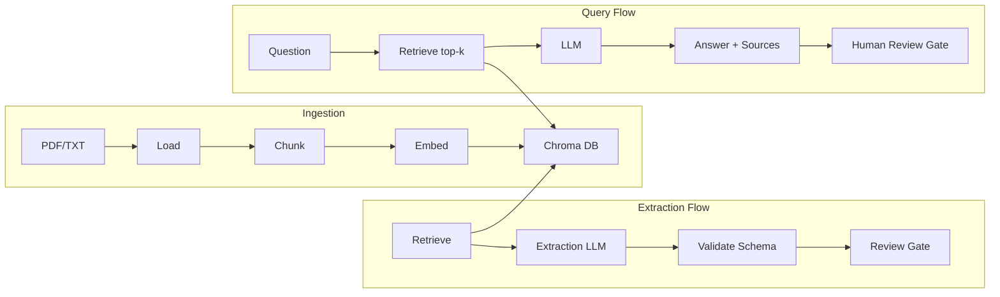
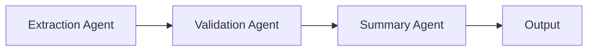
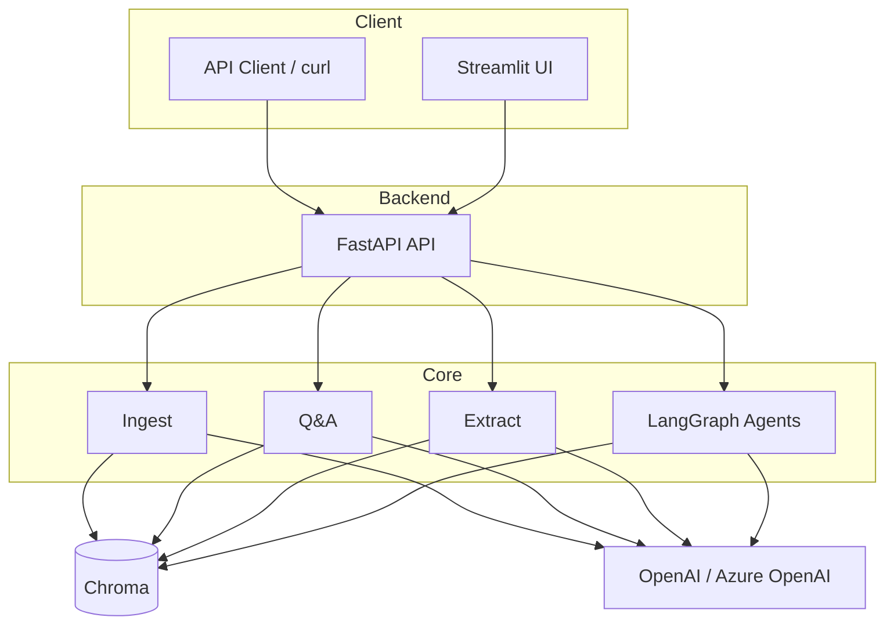

# Architecture

## RAG Pipeline

## Multi-Agent Flow (LangGraph)

## System Overview

## Tech Stack

| Layer | Component |
|-------|-----------|
| UI | Streamlit |
| API | FastAPI (async) |
| Orchestration | LangChain, LangGraph |
| Vector DB | Chroma |
| LLM | OpenAI / Azure OpenAI |
| Tracking | MLFlow |
